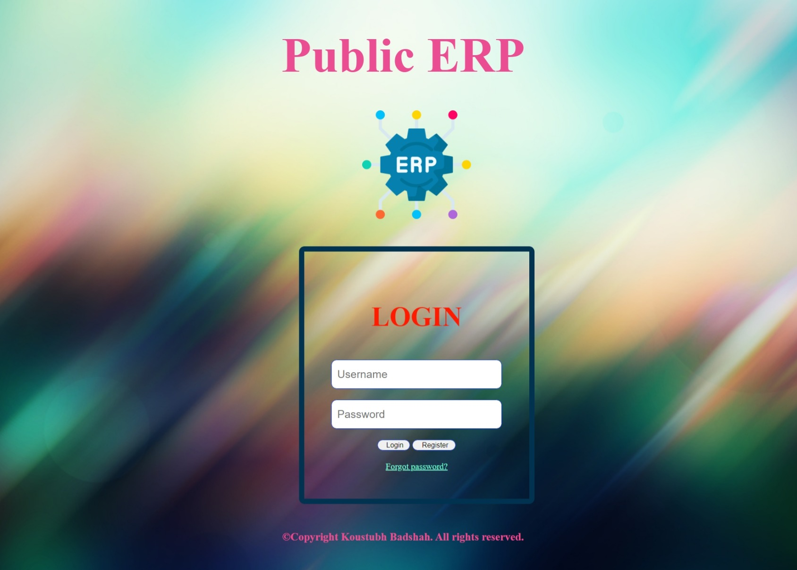

# Project Public ERP
This is an ERP website template it can be used by any organization for maintaing its data anyone is free to edit this and use accordingly. This is an open source ERP and not for sale. This page is still under devlopment and new feature are being continously added to it, anyone intrested can contribute and help us grow and devlope.

# Aim
As ERP is very important for an organisation and ERP are hard to devlope and maintain some organisation and companies charge a lot for their services this project aims to make an ERP for anyone who wants to use it and modify according to their need. 

# Want a persnalised ERP for your Organisation?
If you want a personalised ERP for your organisation you can contact at  
<e-mail>frustateduser@tutanota.com</e-mail>

For knowing more about what is an ERP <a href="https://en.wikipedia.org/wiki/Enterprise_resource_planning">click here</a>

